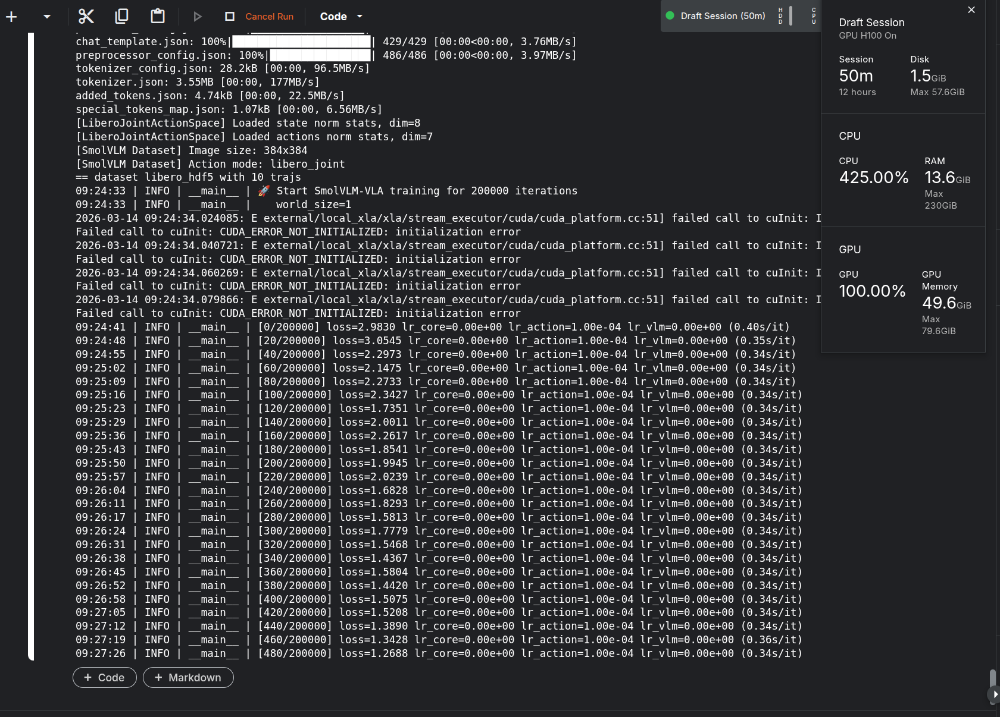
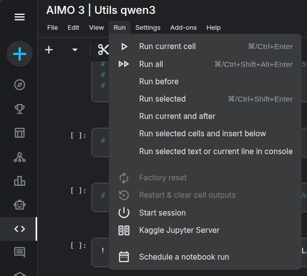
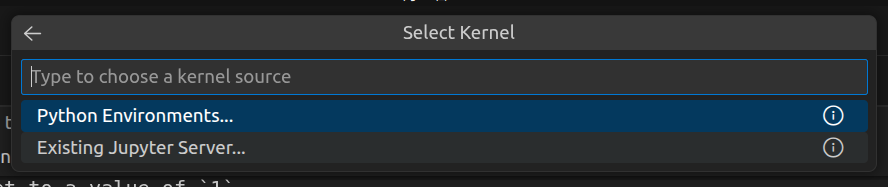

# SimVLA: A Simple VLA Baseline for Robotic Manipulation

| **Paper** | **Website** | **Model & Data** |
| :------------------: | :-----------------------: | :---------------------: |
| [](https://arxiv.org/abs/2602.18224) | [](https://frontierrobo.github.io/SimVLA/) | [](https://huggingface.co/collections/YuankaiLuo/simvla) |

A simple and efficient Vision-Language-Action (VLA) model for robot manipulation tasks.


## 🚩 train your model on kaggle
注：[1] 需要将SSimVLA源代码上传到你自己的github仓库中，使用你的github用户名替换hkx2024。
   [2] kaggle上的训练过程可以参考./train_simvla.ipynb
### 1.下载代码
```bash
! git clone https://github.com/hkx2024/SimVLA
```

### 2.安装环境
```bash
！ cd SimVLA && pip  install -r  ./requirements.txt
```

### 3.创建libero_train.json
```bash
! python SimVLA/create_libero_meta.py \
    --data_dir /kaggle/input/datasets/yolov5ssd/ \
    --subsets  libero-spatial \
    --output ./libero_train.json
! cat ./libero_train.json
# 根据“cat ./libero_train.json”打印的结果替换https://github.com/hkx2024/SimVLA/blob/main/datasets/metas/libero_train.json中的内容。
# 删除原本的SimVLA，并重新下载SimVLA
! rm -rfv SimVLA &&  git clone  https://github.com/hkx2024/SimVLA
```

### 4.创建libero_norm.json
```bash
! python SimVLA/compute_libero_norm_stats.py \
    --data_dir /kaggle/input/datasets/yolov5ssd/ \
    --subsets  libero-spatial \
    --output ./libero_norm.json
# 根据“cat ./libero_norm.json”打印的结果替换https://github.com/hkx2024/SimVLA/blob/main/datasets/metas/libero_norm.json中的内容。
# 删除原本的SimVLA，并重新下载SimVLA
! rm -rfv SimVLA &&  git clone  https://github.com/hkx2024/SimVLA
```

### 5.训练
```bash
! cd  SimVLA  && bash train_smolvlm_small.sh
```



### 6.测评
```bash  
python SimVLA/evaluation/libero_local_eval.py \
    --checkpoint SimVLA/runs/simvla_libero_large/ckpt-150000 \
    --norm_stats SimVLA/norm_stats/libero_norm.json \
    --task_suite libero_spatial \
    --num_trials 10 \
    --gpu_id 0
```

### 7.kaggle下载权重
```bash
import os
import shutil
from IPython.display import FileLink, FileLinks  # 新增 FileLinks 用于处理目录

# 切换到 working 目录（确保路径正确）
os.chdir("/kaggle/working")

# ========== 修复点1：处理目录（SimVLA文件夹） ==========
# 如果要展示目录的可访问链接，用 FileLinks（注意末尾加 /，或直接传目录名）
print("SimVLA目录的访问链接：")
FileLinks("SimVLA")  # 这里不用写全路径，因为已经切换到/kaggle/working

# ========== 修复点2：批量打包下载（核心，推荐） ==========
# 打包整个 working 目录（包含 SimVLA 文件夹）为 zip 文件
# 注意：如果之前生成过同名 zip，先删除避免报错
zip_file_path = "output_files.zip"
if os.path.exists(zip_file_path):
    os.remove(zip_file_path)

# 打包 /kaggle/working 目录下的所有内容（包括 SimVLA 文件夹）
shutil.make_archive("output_files", "zip", "/kaggle/working")

# 生成 zip 文件的下载链接（FileLink 用于单个文件，这里 zip 是文件，可用）
print("\n打包后的下载链接（包含所有文件/文件夹）：")
download_link = FileLink(zip_file_path)
display(download_link)  # 显式展示下载链接
```


### 8.vscode连接kaggle服务器




## Installation

```bash
conda create -n simvla python=3.10 -y
conda activate simvla

pip install torch torchvision --index-url https://download.pytorch.org/whl/cu124
pip install transformers>=4.57.0
pip install peft accelerate fastapi tensorboard uvicorn json_numpy safetensors scipy einops timm mmengine pyarrow h5py mediapy num2words av wandb websockets msgpack_numpy
pip install flash-attn==2.5.6 --no-build-isolation
pip install tensorflow tensorflow-datasets
```

> Important: Use `transformers>=4.57.0`.

## Training (LIBERO Dataset)

### 1. Prepare LIBERO Dataset

Download [LIBERO](https://github.com/Lifelong-Robot-Learning/LIBERO) dataset, and place it in `./datasets/metas/`.

### 2. Create Training Metadata

```bash
python create_libero_meta.py \
    --data_dir ./datasets/metas \
    --subsets libero_10 libero_goal libero_object libero_spatial \
    --output ./datasets/metas/libero_train.json
```

### 3. Compute Normalization Statistics

```bash
python compute_libero_norm_stats.py \
    --data_dir ./datasets/metas \
    --subsets libero_10 libero_goal libero_object libero_spatial \
    --output ./norm_stats/libero_norm.json
```

### 4. Start Training

**Small Model Configuration:**
```bash
bash train_smolvlm_small.sh
```

**Large Model Configuration:**
```bash
bash train_smolvlm_large.sh
```

### 5. Evaluation

```bash
cd evaluation/libero
```

### 6. Results


## Model Architecture

- **Vision-Language Backbone**: SmolVLM-500M-Instruct (576 hidden dim)
- **Action Transformer**: Configurable depth and width
  - Small: 768 hidden, 12 layers, 12 heads
  - Large: 1024 hidden, 24 layers, 16 heads


## Reference

If you find our codes useful, please consider citing our work

```
@article{luo2026simvla,
  title={SimVLA: A Simple VLA Baseline for Robotic Manipulation},
  author={Luo, Yuankai and Chen, Woping and Liang, Tong and Wang, Baiqiao and Li, Zhenguo},
  journal={arXiv preprint arXiv:2602.18224},
  year={2026}
}
```


